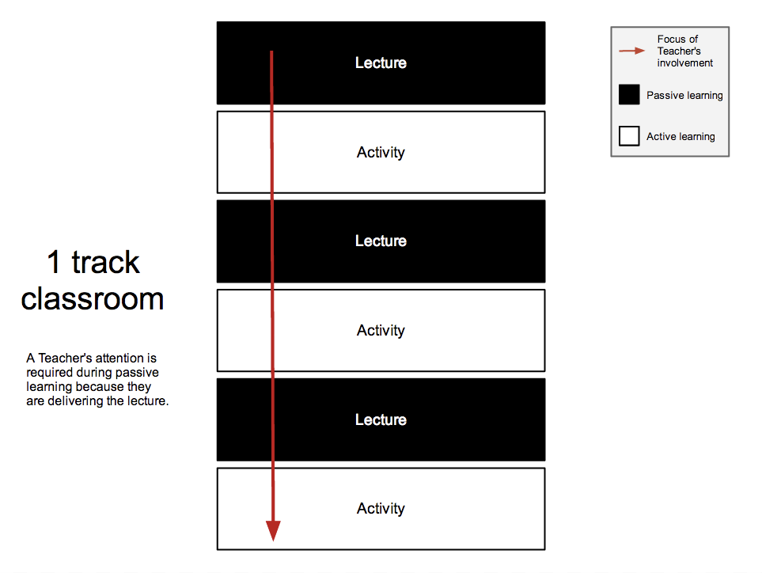

# Video Books, the Manual

## Pages
- [Creating Video Books using a computer with Microsoft Windows](creating-video-books-using-a-computer-with-microsoft-windows)

# The economics of when to use Video for Lectures

Video for lectures is most valuable for lectures that are passive where there is little participation from the student.  In these types of lectures, students receive more value for their time in the classroom by watching a video and having more of a teacher's attention during activities. 

The value of Video Books is not that they are a better experience than a teacher reading the book to the class, in fact in many cases they are not as good as the teacher reading the book.  The value of a Video Book is in how it allows the teacher to spend more time with each student during activities.

